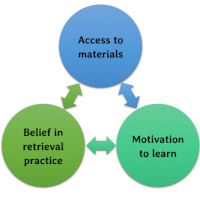

---

---

# 
Research Interests

### How can retrieval-based learning be optimized?
Learning is often conceptualized as the encoding or acquisition of knowledge. Sometime after students have finished learning the material, they are given a test to assess their understanding. Testing, in this view, is seen as nothing more than a diagnostic tool that students do not enjoy completing  and teachers do not enjoy administering. Fortunately, research has consistently demonstrated that enhanced learning arises from taking tests and retrieving information, which vastly outweighs the drawbacks of testing.

My research focuses on leveraging retrieval in new ways to further promote durable learning. From this perspective, I attempted to improve passive reading of feedback by incorporating self-evaluation, examined the mnemonic consequences of combining other learning strategies with retrieval practice, and investigated the robustness of the retrieval practice effect when learners are experiencing test anxiety.

###  How can students' belief in and use of effective learning strategies be increased? </span">
Despite the advances in understanding of how people can learn optimally, many learners are often unaware of the benefits researched-based study strategies afford. Consequently, they underutilize these strategies when studying. A doctor advising her patients to be healthier is ineffective unless she also provides strategies for doing so. Similarly, telling students to study efficiently is not enough. Why should students practice retrieval? How should they go about doing so most efficiently?

From this perspective, I have developed a framework - BAM - to better understand the roadblocks that inhibit students from practicing retrieval. 

1. Belief - Learners need to believe in the efficacy of the learning strategy. If they do not think a learning activity is useful then they will not use it.

2. Access - Learners need to have access to materials that afford engagement in the learning activity. If learners are left without retrieval practice materials then they will be far less likely to engage in retrieval practice as their limited time is first depleted by creating practice questions, notecards, or any other cue that can prompt retrieval. Learners may also mistakenly believe that the creation of these materials leads to long-term learning and may terminate their studying before the materials are adequately used to practice retrieval.

3. Motivation - Learners need to be motivated to learn. If students are not motivated to master the material then they will not use a time-consuming and desirable-difficulty inducing learning strategy.

By using this framework, I have started investigating conditions in which students believe and engage in retrieval-based learning. 
 
